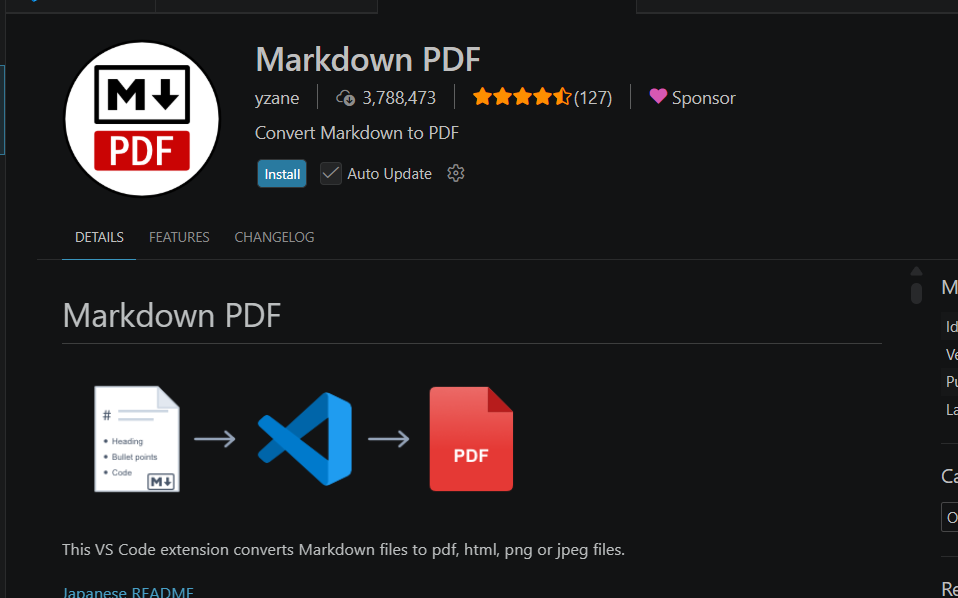

# INVESTIGACIÓN SOBRE MARKDOWN Y HERRAMIENTAS DE DOCUMENTACIÓN

**Nombre:** Brithany Hidalgo

**Materia:** Base de Datos

**Maestro:** Victor Recio

**Curso:** 5to B Informática

---

# Índice

1. Investigación y análisis
2. Sintaxis básica de Markdown
3. Comparación de herramientas
4. Documentación práctica
5. Uso de Visual Studio Code
6. Reflexión
7. Conclusión
8. Reto — Publicación de la documentación

---

# Parte 1 — Investigación y Análisis

## ¿Qué es Markdown?

Markdown es un lenguaje de marcado ligero creado para facilitar la escritura de documentos con formato utilizando texto plano. Su objetivo principal es permitir que los usuarios redacten contenido de forma sencilla y legible sin necesidad de utilizar programas complejos de edición.

## ¿Para qué se utiliza actualmente?

Actualmente, Markdown se utiliza ampliamente en el desarrollo de software, la documentación técnica, la creación de blogs, la elaboración de manuales de usuario y la gestión de proyectos. Plataformas como GitHub, GitBook y Obsidian utilizan Markdown como formato principal para organizar información.

## Ventajas de Markdown

* Es fácil de aprender y utilizar.
* Permite crear documentos organizados rápidamente.
* Funciona en múltiples sistemas operativos.
* Puede convertirse a formatos como HTML y PDF.
* Es ideal para documentación técnica y proyectos de programación.
* Facilita el control de versiones en proyectos colaborativos.

## Limitaciones de Markdown

* Posee opciones limitadas de diseño avanzado.
* No incluye herramientas gráficas integradas.
* Algunas funciones pueden variar dependiendo de la plataforma utilizada.
* Requiere conocer una sintaxis básica para aprovecharlo correctamente.

## ¿Qué significa que sea un lenguaje ligero?

Se considera un lenguaje ligero porque utiliza una sintaxis simple basada en caracteres de texto comunes. Esto permite crear documentos con formato sin consumir muchos recursos ni depender de programas especializados.

---

# Parte 2 — Sintaxis Básica de Markdown

## Títulos y subtítulos

### Ejemplo

```markdown
# Título Principal
## Subtítulo
### Sección
```

## Texto en negrita y cursiva

### Ejemplo

```markdown
**Texto en negrita**
*Texto en cursiva*
```

Resultado:

**Texto en negrita**

*Texto en cursiva*

## Listas ordenadas

### Ejemplo

```markdown
1. Primer paso
2. Segundo paso
3. Tercer paso
```

## Listas desordenadas

### Ejemplo

```markdown
- Computadora
- Internet
- Visual Studio Code
```

## Enlaces

### Ejemplo

```markdown
[Visual Studio Code](https://code.visualstudio.com)
```

## Imágenes

### Ejemplo

```markdown

```

## Bloques de código

### Ejemplo

```python
print("Hola Mundo")
```

## Tablas

### Ejemplo

| Herramienta | Tipo       |
| ----------- | ---------- |
| Markdown    | Lenguaje   |
| Notion      | Plataforma |
| Obsidian    | Aplicación |

## Citas

### Ejemplo

> Markdown facilita la creación de documentación clara y organizada.

## Checklists

### Ejemplo

* [x] Investigación completada
* [x] Comparación realizada
* [ ] Publicación completada

---

# Parte 3 — Comparación de Herramientas

## Markdown vs Notion

| Característica            | Markdown  | Notion    |
| ------------------------- | --------- | --------- |
| Facilidad de uso          | Media     | Alta      |
| Trabajo colaborativo      | Limitado  | Excelente |
| Organización              | Buena     | Excelente |
| Compatibilidad            | Muy alta  | Alta      |
| Exportación de documentos | Excelente | Buena     |
| Uso profesional           | Alto      | Alto      |
| Curva de aprendizaje      | Baja      | Baja      |
| Dependencia de internet   | No        | Sí        |

## Markdown vs Obsidian

| Característica            | Markdown  | Obsidian  |
| ------------------------- | --------- | --------- |
| Facilidad de uso          | Media     | Alta      |
| Trabajo colaborativo      | Limitado  | Medio     |
| Organización              | Buena     | Excelente |
| Compatibilidad            | Muy alta  | Alta      |
| Exportación de documentos | Excelente | Excelente |
| Uso profesional           | Alto      | Alto      |
| Curva de aprendizaje      | Baja      | Media     |
| Dependencia de internet   | No        | No        |

## Markdown vs Google Docs

| Característica            | Markdown  | Google Docs |
| ------------------------- | --------- | ----------- |
| Facilidad de uso          | Media     | Muy alta    |
| Trabajo colaborativo      | Bajo      | Excelente   |
| Organización              | Buena     | Buena       |
| Compatibilidad            | Muy alta  | Alta        |
| Exportación de documentos | Excelente | Excelente   |
| Uso profesional           | Alto      | Alto        |
| Curva de aprendizaje      | Baja      | Muy baja    |
| Dependencia de internet   | No        | Sí          |

---

# Parte 4 — Documentación Práctica

# Guía de Instalación de Visual Studio Code

## Introducción

Visual Studio Code es uno de los editores de código más utilizados en el mundo debido a su rapidez, facilidad de uso y gran cantidad de extensiones disponibles para programadores y estudiantes.

## Requisitos del sistema

* Sistema operativo Windows, Linux o macOS.
* Conexión a Internet.
* Espacio disponible en disco.

## Pasos de instalación

1. Ingresar al sitio oficial de Visual Studio Code.
2. Descargar la versión correspondiente al sistema operativo.
3. Ejecutar el instalador.
4. Aceptar los términos de instalación.
5. Finalizar el proceso y abrir la aplicación.

## Imagen de referencia


## Tabla de ventajas

| Ventaja         | Descripción                    |
| --------------- | ------------------------------ |
| Gratuito        | No requiere pago               |
| Extensible      | Admite cientos de extensiones  |
| Multiplataforma | Compatible con varios sistemas |
| Actualizaciones | Se actualiza constantemente    |

## Ejemplo de código

```python
nombre = "Estudiante"
print("Bienvenido", nombre)
```

## Recursos útiles

* [Sitio oficial de Visual Studio Code](https://code.visualstudio.com)
* [GitHub](https://github.com)
* [Guía de Markdown](https://www.markdownguide.org)

## Conclusión

Visual Studio Code es una herramienta moderna, gratuita y fácil de utilizar. Gracias a sus múltiples características y extensiones, se ha convertido en uno de los editores de código más populares del mundo. Su instalación es sencilla y permite a los usuarios comenzar rápidamente a desarrollar proyectos y crear documentación profesional.

---

# Parte 5 — Uso de Visual Studio Code

Para desarrollar esta práctica se utilizó Visual Studio Code junto con la extensión Markdown PDF.

La vista previa del documento se visualizó mediante el comando:

Ctrl + Shift + V

Posteriormente, el documento fue exportado a formato PDF utilizando la opción:

Markdown PDF: Export (pdf)

Este procedimiento permitió generar un archivo PDF profesional a partir del documento Markdown.

---

# Parte 6 — Reflexión

## ¿Por qué Markdown es tan utilizado en programación y tecnología?

Markdown es ampliamente utilizado porque permite crear documentación clara, rápida y compatible con múltiples plataformas. Además, facilita el trabajo en proyectos de software y el mantenimiento de documentos técnicos.

## ¿En qué situaciones preferirías Markdown sobre herramientas visuales como Notion?

Preferiría Markdown cuando trabaje en proyectos de programación, repositorios de GitHub o documentación técnica donde la simplicidad y compatibilidad sean prioritarias.

## ¿Qué ventajas ofrecen las plataformas colaborativas frente a Markdown tradicional?

Las plataformas colaborativas permiten la edición simultánea de documentos, la comunicación entre equipos y una organización visual más avanzada.

## ¿Crees que Markdown seguirá siendo relevante en el futuro? ¿Por qué?

Sí. Su simplicidad, facilidad de uso y amplia adopción en el mundo tecnológico garantizan que continuará siendo una herramienta importante para la documentación digital.

---

# Conclusión

Markdown es una herramienta eficiente para crear documentación organizada, profesional y fácil de mantener. Su uso en programación, educación y proyectos tecnológicos demuestra su utilidad y relevancia en la actualidad. Además, combinado con herramientas como Visual Studio Code, permite generar documentos de alta calidad en distintos formatos, incluyendo PDF.

---

# Reto — Publicación de la Documentación

## Plataforma utilizada

GitHub

## Organización del proyecto

La documentación fue organizada en diferentes secciones para facilitar la comprensión del tema. Se incluyó una investigación sobre Markdown, ejemplos de sintaxis, comparación de herramientas modernas, una guía práctica de instalación de Visual Studio Code y una reflexión final.

## Evidencias

* Captura del archivo Markdown en Visual Studio Code.
* Captura de la vista previa del documento.
* Captura del PDF exportado.
* Captura del repositorio publicado.

## Enlace del proyecto

[Repositorio de la tarea](https://github.com/brithany01/Tarea-Markdown)

